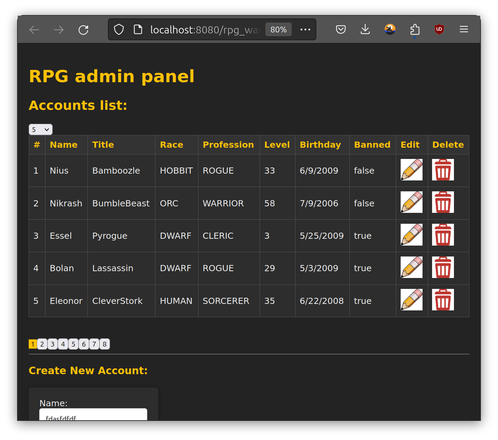
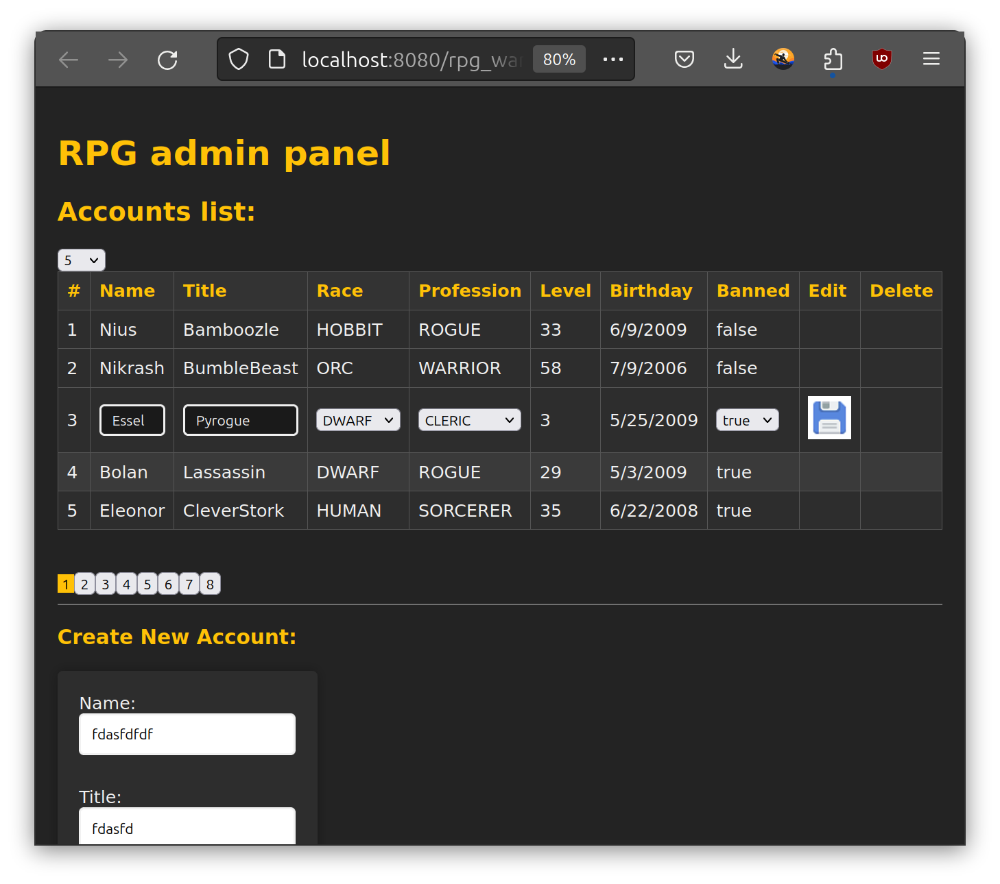

# Admin Panel for Online Game Accounts

## Overview
This project involves creating a UI for managing online game accounts using HTML, CSS, JS, and jQuery. It provides CRUD functionalities and an admin panel to manage various account details.

## Setup
- Server setup: Upon deploying the program, a new tab will open in your selected browser.
- Working files:
    - HTML and scripts: `<project_dir>/src/main/webapp/html/my.html`
    - CSS styles: `<project_dir>/src/main/webapp/css/my.css`

## Features

    
	

### Table Structure
- The table in `my.html` has the following columns:
    - #
    - Name
    - Title
    - Race
    - Profession
    - Level
    - Birthday
    - Banned

### Pagination
- A `
` section below the table contains pagination buttons.
- A function sends a GET request to `/rest/players/count` to retrieve the total number of accounts.
- A dropdown list allows the user to choose how many accounts to display per page (ranging from 3 to 20).

### Editing and Deleting Records
- Additional columns for "Edit" and "Delete" have been added.
- Functions are available for editing and deleting each account.

### Other Features
- The current page number is highlighted for better navigation.
- Upon editing, the "Delete" button is hidden, and the "Edit" icon changes to a "Save" icon.
- Upon saving the edits, the changes are sent to the server.

### Create New Account
- A section allows for the creation of new accounts with the following fields:
    - Name (1-12 characters)
    - Title (1-30 characters)
    - Race (dropdown)
    - Profession (dropdown)
    - Level (0-100)
    - Birthday (date input)
    - Banned (boolean value)
  
## Usage
To add a new account, fill in all the fields in the "Create New Account" section and press the button. The data will be sent to the server via a POST request to `/rest/players`.

---
